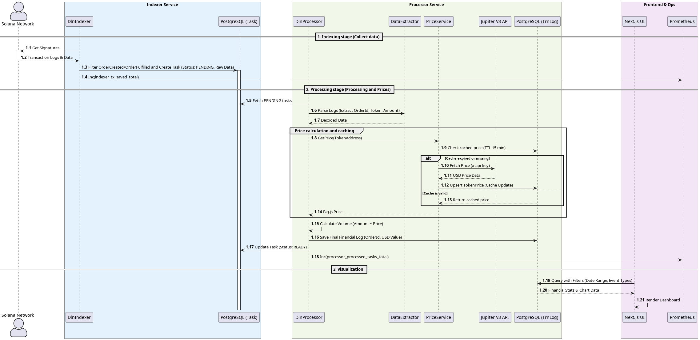

# deBridge DLN Indexer & Monitoring Dashboard

This project is a high-performance monorepo designed to index, process, and visualize **deBridge DLN** (Destination Liquidity Network) cross-chain transactions on Solana. It tracks `OrderCreated` (Source) and `OrderFulfilled` (Destination) events, calculates financial data, and exposes real-time metrics for monitoring.

---

## Architecture Overview

The system is built as a **Yarn Workspaces** monorepo running on **Node.js >=22**:

* **`packages/shared`**: The core domain layer containing the Prisma schema, shared TypeScript types, and database utilities.
* **`packages/indexer`**:
    All services ready to give prometeus metrics
    * **Indexer Service**: Scans the Solana blockchain for specific DLN contract interactions and saves raw transaction data.
    * **Processor Service**: Extracts trade details from raw logs and calculates USD volume.


* **`packages/ui`**: A **Next.js 15+** dashboard for visualizing processed data and system health.

### Sequense diagram



---

## 💰 USD Pricing & Caching Strategy

The `PriceService` handles the conversion of transaction amounts into USD using a robust caching mechanism to ensure performance and stay within API limits:

* **Database Cache**: Before calling external APIs, the service checks the `tokenPrice` table for an existing entry for the specific token.
* **15-Minute TTL**: Cached prices are considered valid if they were updated within the last **15 minutes**.
* **Jupiter V3 API**: If the cache is missing or expired, the service fetches the latest price from the **Jupiter V3 API** using a secure API key.
* **Automatic Updates**: New prices are automatically saved back to the database with a fresh timestamp.

---

## Technical stack

* **indexer + processor**
    * **Runtime:** Node.js(>=v22) / TypeScript / yarn monorepo
    * **Database:** Postgres + Prisma ORM
    * **Monitoring:** [Prometeus] - optional

* **Dashboard:** [React / Next.js]
    * **Framework:** Next.js (App Router)
    * **Visualization:** Apache ECharts (via `echarts-for-react`)
    * **Database:** Postgres + Prisma ORM
    * **Validation:** Zod (for URL search parameters)
    * **Styling:** Tailwind CSS


---

## Launch instructions

### Setup postgres

connect to DB - once
```
-- in psql console
CREATE USER indexer WITH PASSWORD '123test';
ALTER USER indexer WITH SUPERUSER;
ALTER ROLE indexer CREATEROLE CREATEDB;
CREATE DATABASE indexer_db;
GRANT ALL PRIVILEGES ON DATABASE indexer_db to indexer;
```

If you want to see 50000 prepared records on dashboard - you can:
```

xz -dc dump.sql.xz | psql <YOUR-PSQL-OPTIONS-TO-OUR-DATABASE>

```

### Nodejs instructions

1. In root of project once - ```yarn install```
2. In packages/shared - once
```
# fill .env file with value
DATABASE_URL=postgresql://<user>:<pswd>@<HOST>:<PORT>/<DBNAME>

# sync prisma schema to database
yarn run prisma-push
yarn run prisma-gen
```
3. In packages/indexer
```
# fill .env file with values
DATABASE_URL=postgresql://<user>:<pswd>@<HOST>:<PORT>/<DBNAME>
JUPITER_API_KEY=<for https://api.jup.ag/price/v3 service>
INDEXER_RPC_URL=https://mainnet.helius-rpc.com/?api-key=<>
INDEXER_DLN_SOURCE_ADDRESS=src5qyZHqTqecJV4aY6Cb6zDZLMDzrDKKezs22MPHr4
INDEXER_DLN_DESTINATION_ADDRESS=dst5MGcFPoBeREFAA5E3tU5ij8m5uVYwkzkSAbsLbNo
INDEXER_PAGE_LIMIT=100

yarn run indexer
# in separated console
yarn run processor
```

4. In packages/ui
```
# fill .env file with values
DATABASE_URL=postgresql://<user>:<pswd>@<HOST>:<PORT>/<DBNAME>
# run nextjs instance on http://localhost:3000
yarn run dev
```

### Fill database table "Task" - if you need latest transactions from solana

 - Fill with script - about 60 minutes - packages/indexer

```
## for both of them - limit 50000 transactions
# in separated console
yarn run fill-ordercreated
# in separated console
yarn run fill-orderfullfilled

```
----


## Local Development Commands

### `packages/shared`

* `yarn run prisma-gen`: Generates the Prisma Client.
* `yarn run prisma-push`: Syncs the DB structure without migrations.
* `yarn run prisma-reset`: Reset DB schema
* `yarn run prisma-genmigrate`: Generates migration for prisma
* `yarn build`: Compiles the shared package.
* `yarn run lint`: Linting
* `yarn run format`: Pretty code
* `yarn run build`: Build

### `packages/indexer`

* `yarn run lint`: Linting
* `yarn run format`: Pretty code
* `yarn run indexer`: Launches the Solana blockchain scanner.
* `yarn run processor`: Launches the data extraction and pricing service.
* `yarn build`: Compiles using `tsc-alias` to resolve path mappings.
* `yarn test`: Runs the test suite (clears the `prom-client` registry before each test).
* `yarn run fill-ordercreated`: One time script - fill table "Task" with 25000 records for events "OrderCreated"
* `yarn run fill-orderfullfilled`: One time script - fill table "Task" with 25000 records for events "OrderFulfilled"

### `packages/ui`

* `yarn run lint`: Linting
* `yarn run format`: Pretty code
* `yarn run dev`: Starts Next.js in development mode.
* `yarn run build`: Production build.
* `yarn run start`: Launch production

---

## Monitoring

* **Prometheus**: Scrapes metrics from the Indexer and Processor (e.g., `processor_processed_tasks_total`, `indexer_last_slot`)

---

## Pluses and minuses of the solution

### Pluses

1. **Separation of Concerns:** Parsing, Storage and visualisation divided to independent modules
2. **Restart-safe:** Indexer and processor store last step in database and can start from last time
3. **Reproducible:** With the same RPC and IDL, any developer will receive an identical data set.
4. **One point of trust:** All configuration in one place - packages/indexer/src/config.

### Minuses
1. **Periodical RPC polling** - not for realtime(see **Future Improvements & Scalability**)
2. **nextjs usage for dashboard** - no API methods to get statistics (see **Future Improvements & Scalability**)

---

## 🚀 Future Improvements & Scalability

> **Note:** The possibilities are endless, and we're excited to grow this list! But first, let’s sync on who we’re building for and what success looks like for the service.

* **Transition to Geyser Plugin (gRPC Streaming)**
    * Replace the current RPC-based polling (`getSignaturesForAddress`) with a **Yellowstone gRPC** stream.
    * **Why:** This will reduce data ingestion latency from seconds to milliseconds and eliminate the overhead of repetitive HTTP requests.
    * **Reliability:** Streaming ensures 100% data capture even during high network congestion, where standard RPC nodes might drop or rate-limit requests.


* **Migration to NestJS for Backend Services**
    * Move statistics retrieval from Next.js Server Actions to a dedicated **NestJS** microservice.
    * **Why:** To achieve better separation of concerns and utilize NestJS's powerful dependency injection and modularity.
    * **API Documentation:** 
    Implement **Swagger (OpenAPI)** for the new REST API to provide a clear, interactive contract for frontend developers and external integrators.

* **Automated Data Retention Policy (Pruning)**
    * Implement a scheduled cleanup worker (using Cron jobs) to remove old "READY" or "ERROR" tasks from the `Task` table.
    * Use partitioned tables or scheduled workers to prune obsolete logs, maintaining high database performance.
    * **Why:** As the indexer grows, raw transaction logs become obsolete once they are processed into financial records. Pruning ensures the database remains lean, keeps indexes performant, and reduces storage costs.

* **Multi-Provider RPC Health Checks**
    * Implement a monitoring layer to compare `getSlot` height across multiple RPC providers (e.g., Helius, QuickNode).
    * **Impact:** Automatically routes traffic away from "laggard" nodes that fall behind the network tip.

* **Scalable RPC Infrastructure (RPC Proxy Layer)**
    * Implement a specialized RPC Proxy (e.g., Dragonflow or HAProxy) to sit between the indexer and multiple node providers (Helius, QuickNode, etc.).
    * Features:
        * Load Balancing: Distributes requests across multiple providers to prevent rate-limiting.
        * Smart Health Checks: Automatically detects "laggard" nodes (nodes falling behind the network tip) and routes traffic to healthy ones.
        * Response Caching: Reduces costs and latency by caching identical JSON-RPC calls.
    * Impact: Ensures 99.9% data availability even if a single RPC provider experiences downtime or congestion.

* **Resilient Price Discovery for Low-Liquidity Tokens**
   * Implement a Multi-tier Price Fallback mechanism. If Jupiter API lacks data for a new or low-liquidity token, the system will:
   1. Attempt to fetch prices directly from on-chain AMM pools (Raydium/Orca).
   2. Use "Last Known Price" or mark for RETRY_LATER until liquidity is established.

* **High-Concurrency Task Processing (SKIP LOCKED)**
   * Implement Row-Level Locking using PostgreSQL SELECT ... FOR UPDATE SKIP LOCKED for task fetching.
   * Impact: This allows scaling to 10+ parallel worker instances without task duplication or "Unique Constraint" errors, ensuring each transaction is processed exactly once.

* **Hybrid Data Ingestion**
    * Implement a dual-layer strategy: use **Geyser** for real-time "head-of-chain" processing and the current **RPC Indexer** as a fallback/checker to fill potential gaps during network restarts.


* **Advanced Analytics Engine**
    * Extend the UI to include deeper insights such as "Volume by Token Pair", "Protocol Fee Tracking", "Avg 24h $volume", and "User Retention Metrics" using specialized PostgreSQL time-series indexes.

* **Distributed Observability with OpenTelemetry**
    * Integrate OpenTelemetry (OTel) to collect distributed traces, metrics, and logs across all services.

    * **Why**: This provides deep visibility into the system, allowing us to visualize the exact lifecycle of a transaction—from the moment it's picked up by the Indexer to its final storage in the database.

* **Centralized Error Tracking with Sentry**
    * Integrate Sentry SDK across all microservices (Indexer, Processor, and UI).

    * **Why**: To receive real-time alerts on critical failures, such as RPC connection drops, Jupiter API timeouts, or database deadlocks.

    * **Contextual Debugging:** Utilize Sentry's breadcrumbs and tags (e.g., orderId, tokenAddress) to pinpoint exactly why a specific transaction failed to process.

* **Dockerize all components**
    * Wrap all components with docker-compose for CI/CD deploying

---
